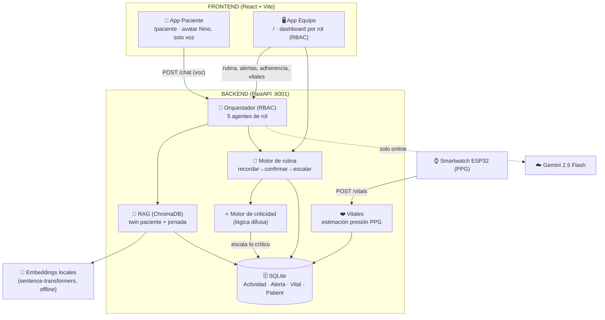
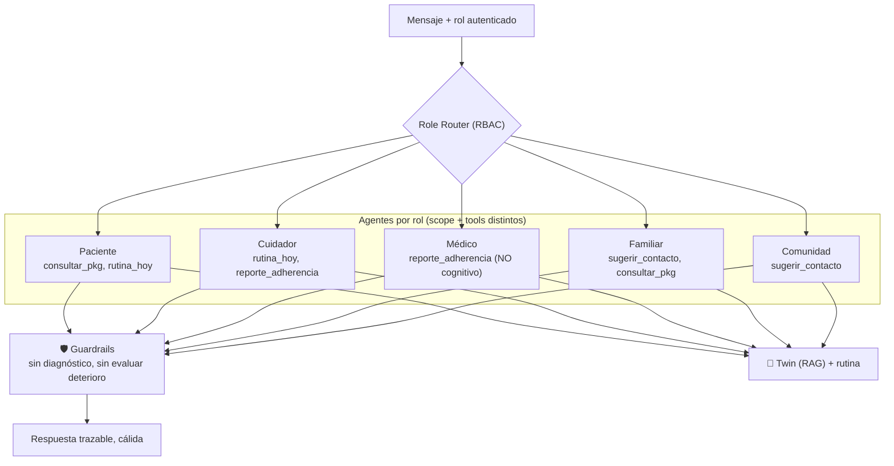
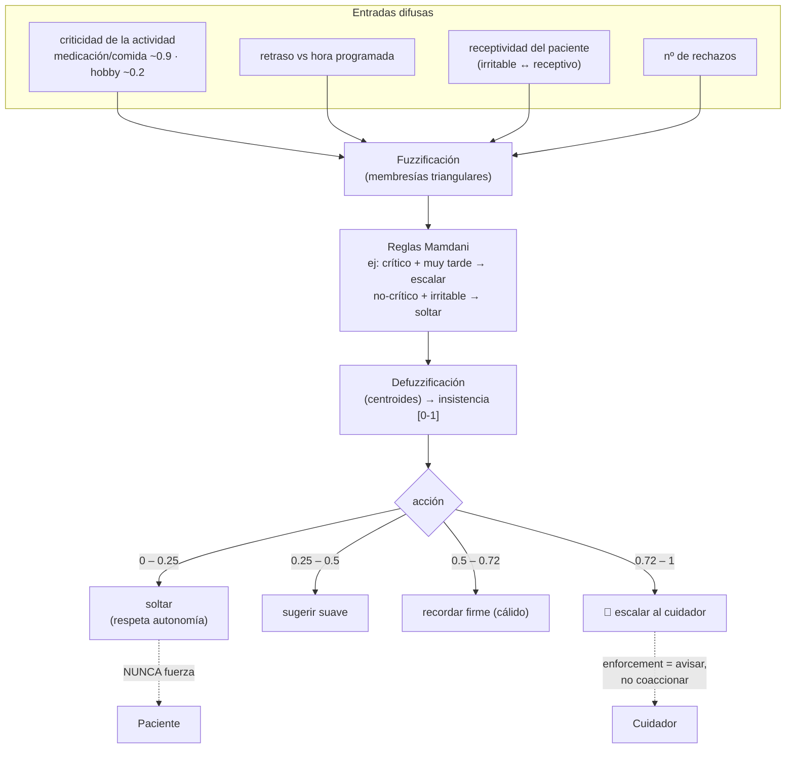
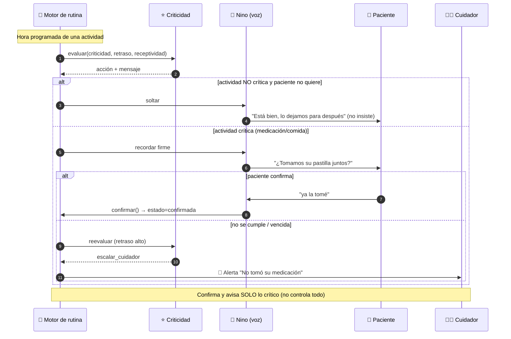
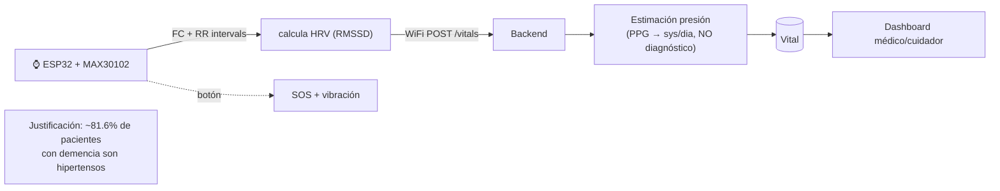
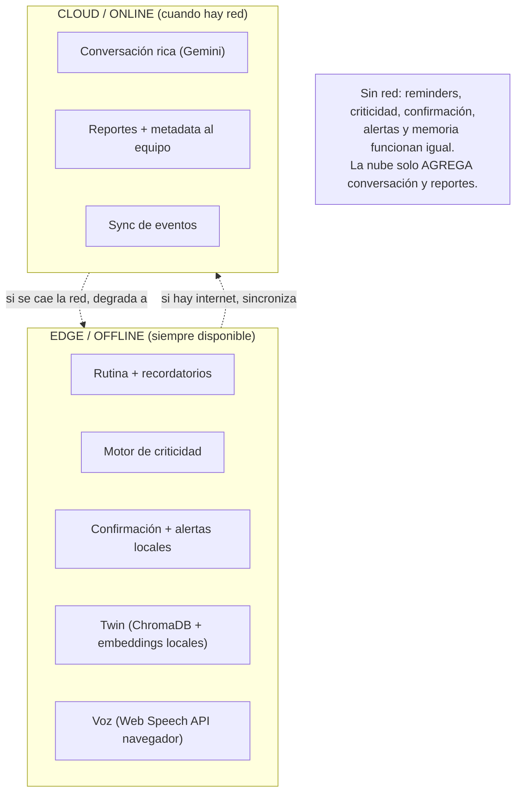
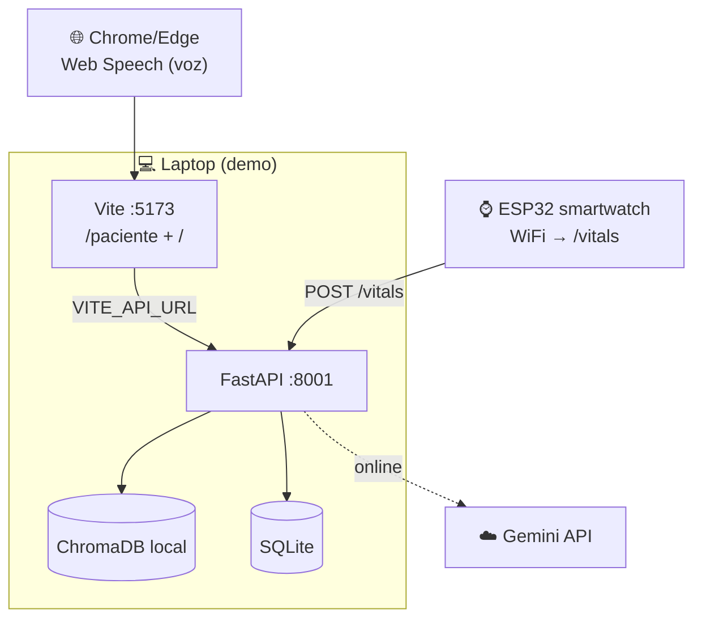

# Diagramas de arquitectura — Nino (post-pivote)

Mermaid. Render en GitHub, VS Code (Markdown Preview Mermaid) o mermaid.live.

> **Alcance vigente (delimitación del hackathon):** recordatorios de una rutina cotidiana +
> **confirmación** + **aviso al cuidador** si no se cumple. Con **motor de criticidad** (lógica
> difusa) que respeta la autonomía. **NO** diagnostica, **NO** evalúa deterioro cognitivo, **NO**
> usa cámara. El monitoreo de vitales (smartwatch PPG) es **cardiovascular**, no cognitivo.
> Diagramas de la versión anterior (biomarcadores/cámara) → historial git y `backup/`.

---

## 1. C4 Nivel 1 — Contexto

```mermaid
graph TB
    subgraph Personas["Red de cuidado"]
        PAC["👵 Paciente<br/>(Alzheimer leve-moderado)"]
        CUI["🧑‍⚕️ Cuidador"]
        MED["👨‍⚕️ Médico"]
        FAM["👨‍👩‍👧 Familiar"]
        COM["🌐 Comunidad"]
    end

    SIS["🎼 NINO<br/>Asistente-guía de rutina orquestado por IA<br/>(RBAC · criticidad · offline-first)"]

    GEM["☁️ Gemini 2.5 Flash<br/>(solo online: conversación + reportes)"]
    SW["⌚ Smartwatch PPG<br/>(FC/HRV, presión estimada)"]
    LOC["📍 Ubicación<br/>(AirTag / GPS app)"]

    PAC -->|habla por voz| SIS
    SIS -->|recuerda, confirma, acompaña<br/>SIN forzar| PAC
    CUI -->|configura rutina + criticidad| SIS
    SIS -->|alerta SOLO si algo crítico falla| CUI
    MED -->|carga indicaciones/medicación| SIS
    SIS -->|adherencia + vitales (no cognitivo)| MED
    FAM -->|recibe sugerencias de contacto| SIS
    COM -->|matching de pares| SIS

    SIS <-->|online| GEM
    SW -->|vitales| SIS
    LOC -->|posición| SIS
```

---

## 2. C4 Nivel 2 — Contenedores



---

## 3. C4 Nivel 3 — Orquestador (RBAC) + criticidad



---

## 4. ⭐ Motor de criticidad (el diferenciador)



---

## 5. Flujo de rutina — recordar → confirmar → escalar (secuencia)



---

## 6. Vitales — smartwatch PPG (cardiovascular, no cognitivo)



---

## 7. Modos offline ↔ online (edge-first)



---

## 8. Despliegue (demo)


