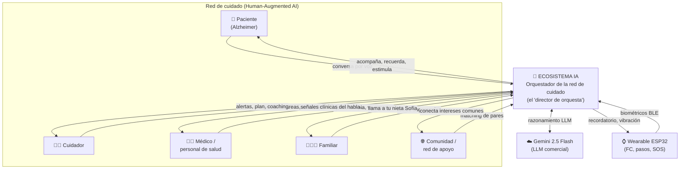
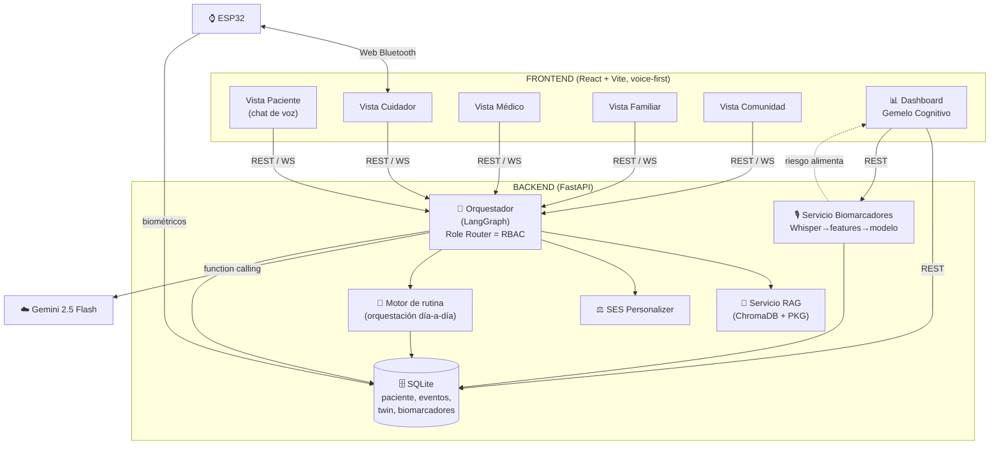
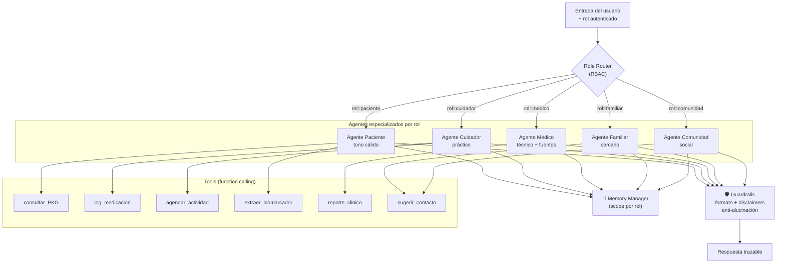
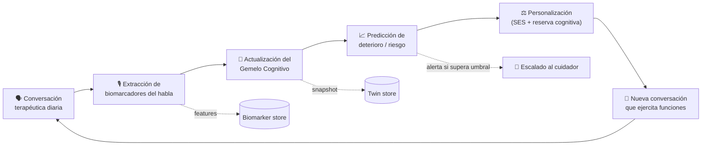
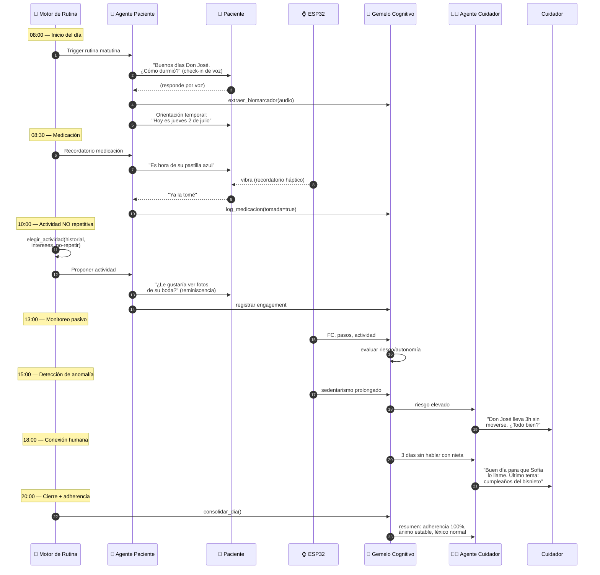
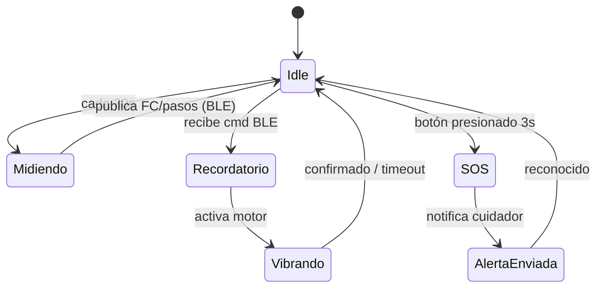
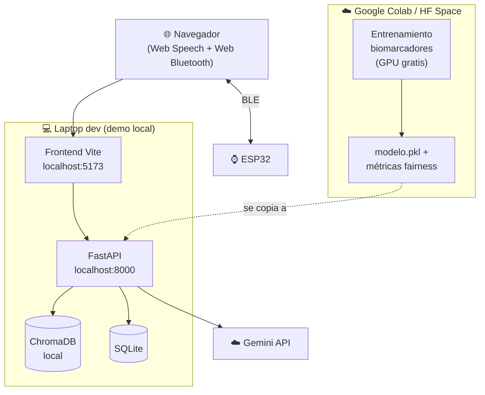

# Diagramas de arquitectura — Ecosistema Alzheimer

Todos en Mermaid. Render en GitHub, VS Code (extensión Markdown Preview Mermaid) o mermaid.live.

---

## 1. C4 Nivel 1 — Contexto

---

## 2. C4 Nivel 2 — Contenedores

---

## 3. C4 Nivel 3 — Componentes del Orquestador (RBAC)

---

## 4. Loop cerrado — conversación como biomarcador (núcleo diferenciador)

---

## 5. ⭐ Orquestación del día-a-día del paciente (requerido)

Secuencia de un día típico gestionado por el Motor de Rutina + agentes.

---

## 6. Máquina de estados del wearable ESP32

---

## 7. Despliegue (hackathon)

