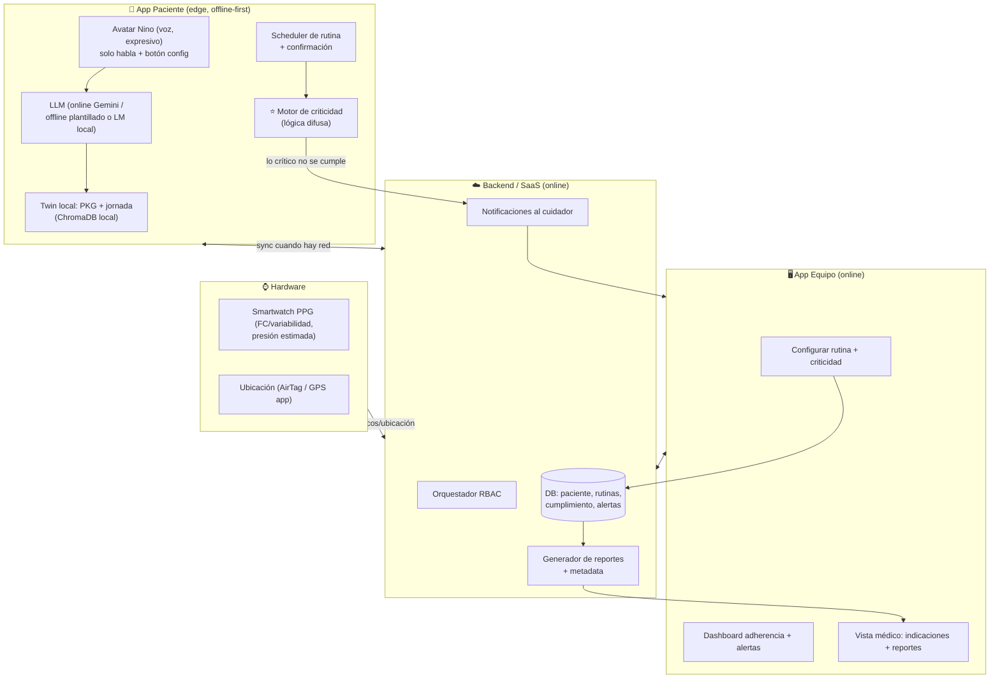

# Plan de ejecución e integración v2 — Nino (post-pivote)

> Fecha: 2026-07-03. Reemplaza al plan v1 (biomarcadores/visión, ahora en `backup/`).
> Alineado a la **delimitación oficial**: recordatorio de una actividad cotidiana + confirmación +
> aviso al cuidador. Sin diagnóstico, sin evaluación cognitiva, sin controlar todo.

---

## 1. Reencuadre del producto

**Nino = asistente-guía de rutina, orquestado por IA, que respeta la autonomía del paciente.**

Lo que lo hace ganador (y llena el hueco del estado del arte, doc 03):
1. Recuerda **por voz**, confirma si se hizo, y **avisa al cuidador solo si algo crítico falla**.
2. **Motor de criticidad (lógica difusa)**: decide cuánto insistir según qué tan crítica es la
   actividad y el estado del paciente. **Nunca fuerza.** (medicación/comida = crítico; leer = suelto.)
3. **Offline-first**: el paciente siempre tiene su asistente aunque no haya internet.
4. **Contexto LATAM**: voz en español, baja escolaridad, hipertensión, ubicación por desorientación.

Cumple la delimitación: aunque el twin conoce *todas* las rutinas, **solo se enforce lo crítico**;
el resto es sugerencia permisiva → "no controla todas las actividades".

---

## 2. Qué se implementa vs concepto vs descartado

### ✅ SE CONSTRUYE (núcleo del hackathon)
- **Motor de recordatorios de rutina** con **confirmación** ("¿ya tomaste la pastilla?") y
  **escalado al cuidador** cuando no se completa lo crítico. ← *cumple el alcance obligatorio*.
- **Motor de criticidad difuso** (el diferenciador): pondera criticidad + retraso + receptividad.
- **App Paciente** (voz + avatar Nino expresivo, ultra-simple, solo habla) — ya scaffoldeada en `frontend/`.
- **App Equipo** (cuidador/médico): configurar rutina + criticidad, ver adherencia, recibir alertas — ya scaffoldeada.
- **Twin del paciente + twin de la jornada** sobre ChromaDB + RAG (reusar `backend/rag`).
- **RBAC** por rol (reusar `backend/orchestrator`), ajustado a paciente/cuidador/médico/familiar.
- **Offline fallback** documentado + funcional (respuestas locales + cola de sync).
- **Firmware smartwatch** (FC por PPG, reusar `hardware/unoq_mcu`/`esp32`).

### 🔶 CONCEPTO / MOCK (se muestra, no producción)
- **Edge LLM on-device** (correr el LM local en el Uno Q/celular): se muestra la arquitectura; el
  MVP usa **Gemini online** + **fallback offline plantillado**. LLM local = stretch si sobra tiempo.
- **Estimación de presión por PPG** (para hipertensos): concepto + FC/variabilidad real; la presión
  no invasiva necesita calibración → se demuestra como inferencia estimada.
- **Ubicación (AirTag larga duración)**: mapa mock + compartir desde app; integración real = roadmap.

### 🗄️ DESCARTADO → `backup/` (prohibido por el hackathon)
- Biomarcadores de voz / detección de deterioro (`backup/ml-biomarcadores-descartado/`).
- Cámara / visión / memoria espacial (`backup/uno_q-vision-camara-descartado/`).
- Endpoints de biomarcadores del backend → se quitan en implementación.

---

## 3. Arquitectura (contenedores)

Diagramas C4 detallados y de flujo: se actualizan en `docs/diagrams/arquitectura.md` (los de
rutina/RBAC siguen válidos; se quitan los de biomarcadores/ESP32-BLE, se añade el de criticidad).

---

## 4. Motor de criticidad (el diferenciador) — diseño

**Objetivo:** decidir, para cada actividad pendiente/no cumplida, **cuánto insistir** y **si escalar
al cuidador**, respetando la autonomía (nunca forzar).

**Entradas (variables difusas):**
- `criticidad_base` de la actividad [0-1]: medicación/comida ≈ 0.9; cita ≈ 0.7; higiene ≈ 0.6; hobby/leer ≈ 0.2.
- `retraso` respecto a la hora programada: nada / poco / mucho.
- `receptividad` del paciente (inferida de la conversación): irritable / neutral / receptivo.
- `n_rechazos` recientes de esa actividad.

**Reglas (ejemplos):**
- SI criticidad alta Y retraso mucho → insistencia **alta** + **escalar al cuidador**.
- SI criticidad alta Y receptividad baja → insistir **suave y cálido**, reintentar luego, escalar si persiste.
- SI criticidad baja Y receptividad baja → **soltar** (no insistir), reprogramar u ofrecer alternativa.
- SI criticidad media Y retraso poco → recordatorio **suave**.

**Salida (defuzzificada):** `nivel_insistencia` [0-1] → acción:
`sugerir_suave` · `recordar` · `recordar_firme` · `escalar_cuidador` · `soltar/reprogramar`.

**Regla de oro:** el "enforcement" de lo crítico es **avisar al cuidador**, NUNCA coaccionar al
paciente. El tono al paciente siempre es cálido.

**Implementación:** `scikit-fuzzy` (skfuzzy) para el sistema difuso (da el factor "novedoso" y es
explicable), con fallback a un motor de pesos simple si el tiempo aprieta. Módulo nuevo:
`backend/criticality/engine.py`. Se integra en `backend/routine/engine.py` (que ya existe).

---

## 5. Integración con lo ya construido

| Componente existente | Qué se hace |
|---|---|
| `backend/orchestrator/` (RBAC 5 roles) | **Se mantiene**; ajustar prompts al foco de rutina/acompañamiento |
| `backend/rag/` (PKG + ChromaDB) | **Se mantiene** = twin del paciente; añadir twin de jornada |
| `backend/routine/engine.py` | **Se extiende**: confirmación + escalado + integrar motor de criticidad |
| `backend/db/models.py` | Añadir a `Event`/nueva tabla `Actividad`: criticidad, estado_confirmacion, hora |
| `backend/biomarkers/` + endpoints | **Se elimina** (descartado) |
| `backend/ses/personalizer.py` | **Se reusa** como personalización cultural (no como detección) |
| `frontend/` (2 apps + avatar Nino) | **Se mantiene** = App Paciente + App Equipo; conectar a endpoints reales |
| `hardware/unoq_mcu` + `esp32` | **Se reaprovecha** como smartwatch PPG (FC/variabilidad) |
| `backend/criticality/` | **Nuevo** = motor difuso |

---

## 6. Plan de tareas (equipo, tiempo restante)

| Track | Responsable | Tareas |
|---|---|---|
| **Motor de criticidad + rutina** | Alvaro | `criticality/engine.py` (skfuzzy), extender `routine/engine.py` con confirmación + escalado, modelo `Actividad` |
| **Backend limpieza + reportes** | Alvaro | Quitar biomarcadores; endpoints de configurar rutina, confirmar actividad, alertas, reporte de adherencia |
| **App Paciente (voz + avatar)** | Frontend | Conectar avatar Nino a `/chat`; loop de recordatorio-confirmación por voz; botón config cuidadores/médicos |
| **App Equipo (dashboard)** | Frontend | Configurar rutina + criticidad; ver adherencia + alertas en tiempo real; vista médico (indicaciones) |
| **Twin de jornada + offline** | Alvaro | Journey twin sobre ChromaDB; fallback offline (plantillas + cola de sync) |
| **Smartwatch PPG** | Alvaro/HW | Firmware FC/variabilidad; concepto de presión estimada; ubicación mock |
| **Contenido + validación** | Contacto-paciente | Transcribir `ENTREVISTA/`; guiones de recordatorio cálidos (no imperativos); validar criticidades |
| **Diseño + pitch** | Diseño | Avatar expresivo (estados de ánimo de Nino); slides; historia de impacto (Rosa); mockups AirTag/reportes |

---

## 7. Criterios de "hecho" para la demo

- [ ] Se configura **una rutina** (ej: medicación 10:00) desde la App Equipo.
- [ ] Nino se la recuerda al paciente **por voz**, cálido, con auto-inicio.
- [ ] El paciente confirma ("ya la tomé") → queda registrado.
- [ ] Si NO se cumple lo crítico → **el cuidador recibe alerta** (no ruido en lo no crítico).
- [ ] Una actividad **baja criticidad** (leer) que el paciente rechaza → Nino **la suelta sin forzar**.
- [ ] Dashboard del equipo muestra adherencia + alerta.
- [ ] Funciona **sin internet** (fallback demostrable).
- [ ] Smartwatch muestra FC (o video backup); ubicación en mapa (mock).
- [ ] Pitch: delimitación cumplida + diferenciador (criticidad/autonomía) + datos LATAM + estado del arte.

---

## 8. Riesgos

| Riesgo | Mitigación |
|---|---|
| Sobre-prometer "controla todo" (rompe delimitación) | Enfatizar: solo se enforce lo crítico; el resto es permisivo |
| Edge LLM local no llega en el tiempo | MVP con Gemini online + fallback plantillado; LM local = concepto |
| Presión por PPG no es clínica | Presentar como **estimación** + FC real; no diagnóstico |
| Lógica difusa consume tiempo | Fallback a motor de pesos si skfuzzy se complica |
| Parecer vigilancia (choca con autonomía) | Mensajería cálida, "no forzar", control del paciente sobre quién lo cuida |
